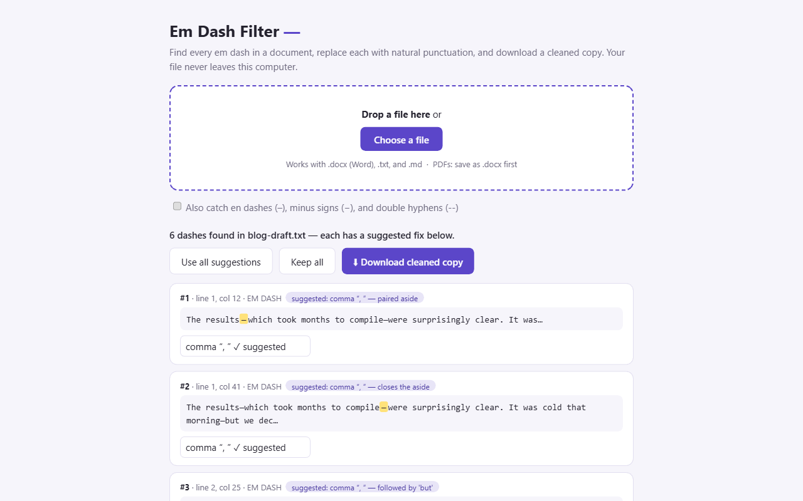

# Em Dash Filter —

A tool to help "un-AI" your AI texts. LLM-written prose has a tell: em dashes,
lots of them. Em Dash Filter finds every em dash in a document, suggests a
natural replacement for each one, and produces a cleaned copy that reads just
as well — without the dashes.

Comes in two flavors:

- **Browser extension** (Chrome + Firefox) — file picker, per-dash review
  cards, one-click download of the cleaned copy
- **CLI** (`cli/find_emdashes.py`) — scan, bulk-replace, smart auto-fix, and
  interactive modes for terminal users

Both run **entirely on your machine**. No uploads, no AI cloud, no telemetry,
no permissions. The "smart" engine is plain grammatical rules.



## Install

- **Firefox:** [addons.mozilla.org/firefox/addon/em-dash-filter](https://addons.mozilla.org/en-US/firefox/addon/em-dash-filter/)
- **Chrome:** Chrome Web Store (in review) — or load `extension/` unpacked via
  `chrome://extensions` with Developer mode on
- **CLI:** copy `cli/find_emdashes.py` anywhere; Python 3.8+, no dependencies
  (`pip install pypdf` only if you want PDF scanning)

## How the smart engine decides

Each em dash is classified by its sentence context, in priority order:

| Pattern | Replacement |
|---|---|
| Paired dashes (an aside) | commas — or parentheses if the aside contains commas |
| Followed by *but / which / and / though...* | comma |
| Introduces a list | colon |
| Short afterthought | comma |
| Joins two full sentences | period (next word auto-capitalized) |
| Number range (`1994—2001`) | plain hyphen |
| Line-start attribution (`— Oscar Wilde`) | kept |
| Everything else (elaboration) | colon |

Also catches en dashes, minus signs, horizontal bars, and `--` when asked.

## CLI usage

```
python find_emdashes.py essay.docx            # list every em dash with context
python find_emdashes.py essay.docx -s         # smart auto-fix, save a cleaned copy
python find_emdashes.py essay.docx -s --dry   # preview decisions, write nothing
python find_emdashes.py essay.docx -i         # review each one (Enter accepts suggestion)
python find_emdashes.py essay.docx -r --replace " - "   # dumb replace-all
```

Supports `.txt`/`.md`/plain text and `.docx` with zero dependencies (it reads
the Word XML directly); `.pdf` is scan-only. The original file is **never**
modified — cleaned output goes to `essay.nodash.docx` next to it, and existing
files are never overwritten.

## Extension architecture

No libraries, no build step:

- `emdash.js` — the engine: dash finding, smart classification, edit
  application. Ported 1:1 from the CLI (verified byte-identical output).
- `zip.js` — minimal zip reader/writer for `.docx`, using the browser's
  built-in `DecompressionStream`.
- `app.html/css/js` — the review UI.
- `background.js` — opens the app tab; the only extension API used.

`build.py` produces the store zips (Firefox keeps the dual-background manifest
and gecko settings; Chrome gets `service_worker` only).

## License

MIT — see [LICENSE](LICENSE).
